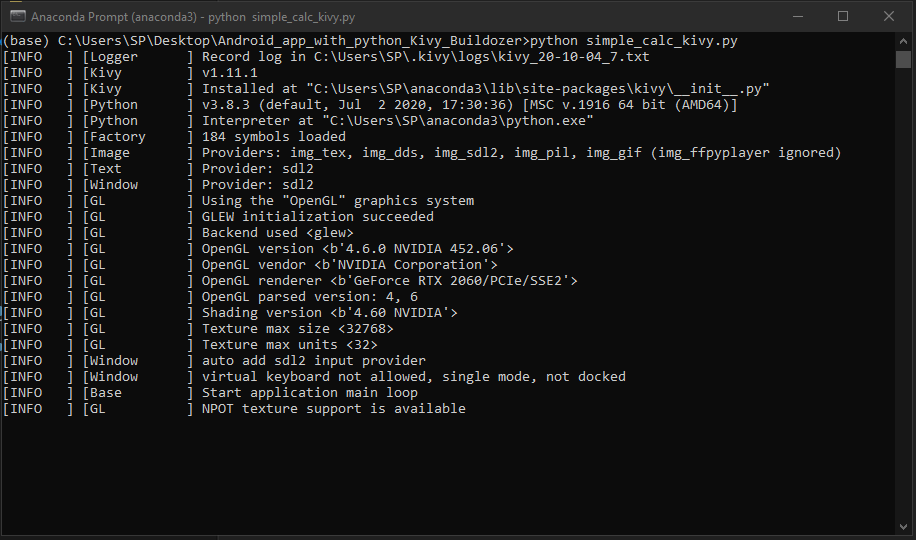
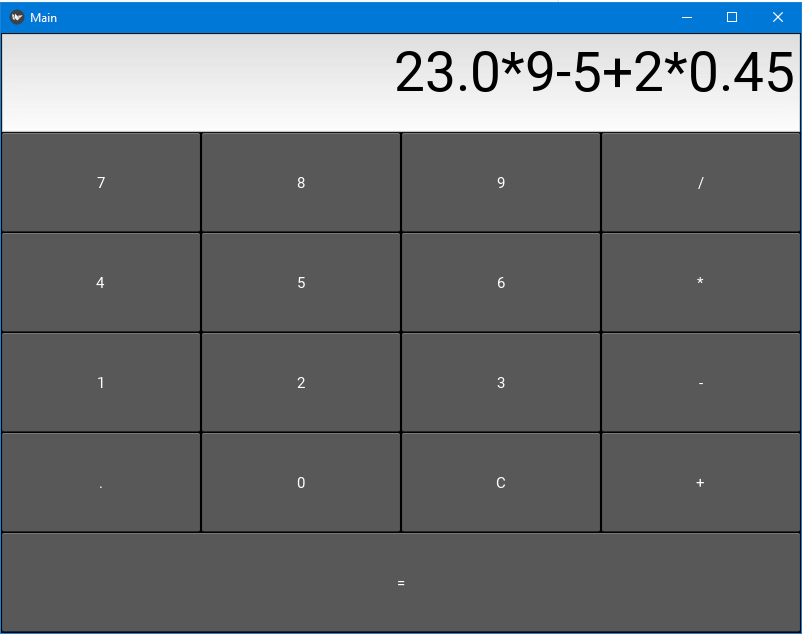

# Android_app_with_python_Kivy_Buildozer
I have built a small calculator app using python for android devices. 

Please Note:

To run the 'simple_calc_kivy.py' on your windows or linux machine app, you must install kivy using pip install kivy on your machine first. Then run the file in terminal with 'python simple_clc_kivy.py.

I have not yet packaged the app for android as the Code has following issues which are being looked into:

1. DivisionbyZero Error is being caught as exception but nothing being done on the app. 
2. App will not let you divide, if denominator has number starting with zero.

Also this app supports simple functionality only as of now. I am working to enhance the app further.
